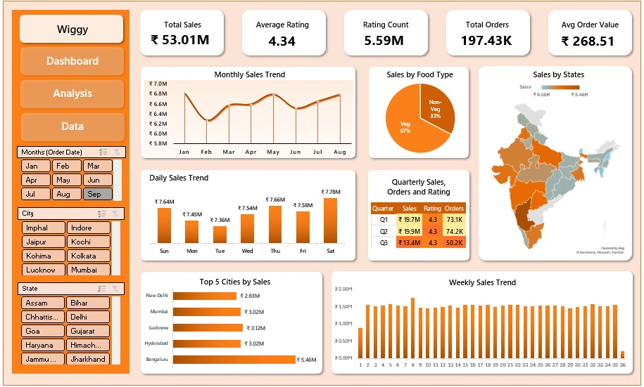

# Food Delivery Sales Dashboard 

An interactive **Sales Analytics Dashboard** created using **Microsoft Excel** to analyze food delivery business performance across **sales, orders, ratings, food types, cities, and states in India**.

This project demonstrates how Excel can be effectively used for **business intelligence, KPI tracking, and data-driven decision making**.

---

## 📌 Problem Statement

Food delivery platforms generate large volumes of order data. The challenge is to **organize, analyze, and visualize this data** to understand business performance and customer behavior.

This Excel dashboard answers key business questions:

* How much total revenue is generated?
* How many orders are received?
* What is the average order value?
* How satisfied are customers?
* Which cities and states generate maximum sales?
* How do sales change over time (monthly, weekly, daily)?

---

## 🎯 Business Requirements (BRD – KPIs)

The following Key Performance Indicators are calculated using **Excel formulas and Pivot Tables**:

* **Total Sales (₹)** – Overall revenue generated from food orders
* **Total Orders** – Number of food orders received
* **Average Order Value (₹)** – Revenue per order
* **Average Rating** – Customer satisfaction level
* **Ratings Count** – Total number of customer reviews

---

## 📊 Dashboard Visualizations (BRD – Charts)

All visualizations are created using **Excel Pivot Charts and standard charts**:

1. **Monthly Sales Trend**
   Displays month-wise fluctuation in total sales.

2. **Daily Sales Trend**
   Shows sales variation across days of the week.

3. **Weekly Sales Trend**
   Helps identify peak and low-performing weeks.

4. **Sales by Food Type (Veg vs Non-Veg)**
   Compares revenue contribution by food category.

5. **Sales by State**
   State-wise revenue distribution using map/chart visualization.

6. **Quarterly Performance Summary**
   Sales, Orders, and Ratings summarized quarter-wise.

7. **Top 5 Cities by Sales**
   Highlights cities contributing the highest revenue.

---

## 🛠️ Tools & Features Used (Excel Only)

* **Microsoft Excel**
* Pivot Tables & Pivot Charts
* Excel Formulas (SUM, AVERAGE, COUNT)
* Slicers (Month, City, State)
* Data Cleaning & Formatting
* Conditional Formatting

---

## 🚀 How to Use

1. Download the Excel file (`.xlsx`)
2. Open in **Microsoft Excel (2016 or later)**
3. Use slicers to filter by **Month, City, or State**
4. Analyze KPIs and trends dynamically

---

## 🙌 Conclusion

This Excel dashboard provides a clear overview of **sales performance, customer satisfaction, and regional trends** for a food delivery business. It proves that **Excel alone** can be a powerful tool for business analytics and reporting.

---

⭐ If you like this project, feel free to star the repository!

## 📊 Dashboard Preview

